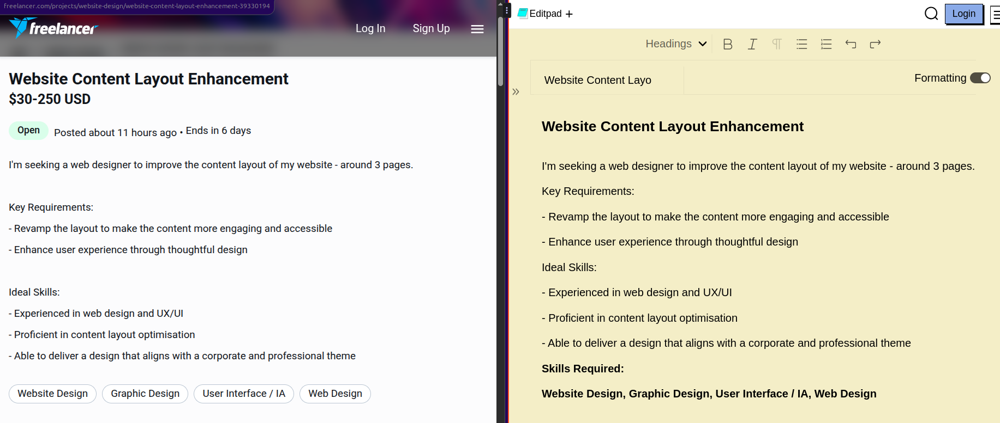

# Copy Project Details Chrome Extension for freelancer.com

A Chrome extension that allows you to easily copy project details from web pages.

## Features

- Copy project title and description from logged-in view
- Copy project details from incognito/logged-out view
- Extracts required skills automatically
- User-friendly popup interface
- Error handling and status messages
- Context menu support for quick access

## Installation

1. Clone this repository or download the source code
2. Open Chrome and navigate to `chrome://extensions/`
3. Enable "Developer mode" in the top right corner
4. Click "Load unpacked" and select the extension directory

## Usage

1. Navigate to a project page
2. Click the extension icon in your Chrome toolbar
3. Choose either:
   - "Copy Details" for logged-in view
   - "Copy From Incog Details" for logged-out view
4. The extension will copy the project title, description, and required skills to your clipboard

## Project Structure

- `manifest.json` - Extension configuration and permissions
- `popup.html` - Extension popup interface
- `popup.js` - Main extension logic and content scripts
- `readme.md` - This documentation file

## Permissions Required

- `activeTab` - To access the current tab's content
- `clipboardWrite` - To copy text to clipboard
- `scripting` - To inject and execute content scripts

## Development

To modify the extension:
1. Make your changes to the source files
2. Go to `chrome://extensions/`
3. Click the refresh icon on the extension card
4. Test your changes

## Known Limitations

- The selectors are specific to certain webpage structures and may need updates if the target site changes
- Extension needs appropriate permissions to function
- Must be on a compatible webpage for the copy function to work

## Contributing

Feel free to submit issues and pull requests for improvements.

## License

This project is open source and available under the MIT License.